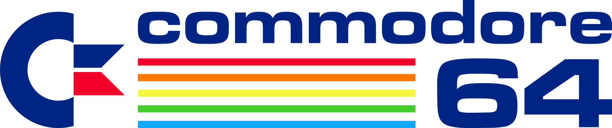

# Commodore 64

## Emuladores

### VirtualC64 (macOS)

http://www.dirkwhoffmann.de/virtualc64/

## Herramientas

### CBM .prg Studio (Windows)

http://www.ajordison.co.uk/index.html

A handy Commodore 8-bit program development utility for Windows

### C64 List (Windows)

https://www.facebook.com/c64List

### CharPad 2.6 (Free Edition) (Windows)

https://subchristsoftware.itch.io/charpad-free-edition

CharPad is a graphics data editing tool that facilitates the production of graphics data in a format compatible with the legendary Commodore 64 home computer.

### Petmate - C64 PETSCII editor (Windows, macOS, Linux)

https://nurpax.github.io/petmate/

Petmate is a cross-platform C64 PETSCII image editor, drawing inspiration from the PETSCII editor.

## Tutoriales

### Programación Retro del Commodore 64

https://programacion-retro-c64.blog/

### Cómo pasar listados de PC a C64 y viceversa

https://www.commodorespain.es/como-pasar-listados-de-basic-a-txt-texto-y-viceversa-en-commodore-64/
