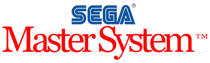

# Sega Master System

## Entornos de desarrollo - librerías

### devkitSMS

https://github.com/sverx/devkitSMS

A collection of tools and code (with a very presumptuous name) for SEGA Master System / SEGA Game Gear / SEGA SG-1000 homebrew development using 'C' language (and the SDCC compiler).

Examples: http://steveproxna.blogspot.com/search/label/devkitSMS

### PSGLib

https://github.com/sverx/PSGlib

Z80 ASM library (and C conversion/compression tools) to allow replay of VGMs as background music/SFX in SEGA 8 bit homebrew programs

## Emuladores

### Gearsystem

https://github.com/drhelius/Gearsystem

Gearsystem is a cross-platform Sega Master System / Game Gear / SG-1000 emulator written in C++ that runs on Windows, macOS, Linux, iOS, Raspberry Pi and RetroArch.

## Tutoriales 

### DevkitSMSTutorial

https://www.elotrolado.net/wiki/DevkitSMSTutorial
