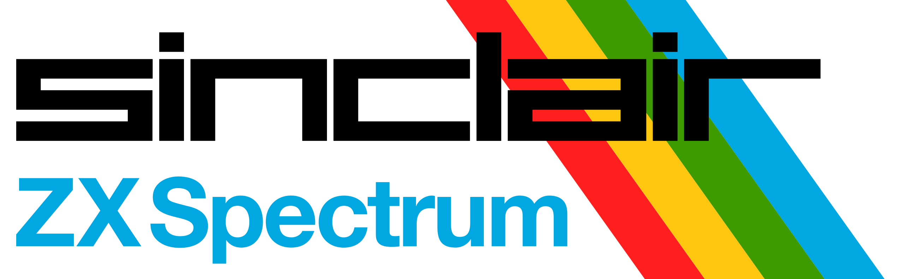

# Sinclair ZX Spectrum

## Emuladores

### Retro Virtual Machine (Windows, macOS, Linux)

https://www.retrovirtualmachine.org/

## Enlaces

### Recursos de programación para ZX Spectrum 

https://wiki.speccy.org/programacion/recursos_prog/indice

## Entornos de desarrollo - librerías

### FASE

http://www.mojontwins.com/juegos-de-colegas/fase/

FASE es un engine para ZX Spectrum que te ayuda a crear un tipo muy específico de juego: plataformas sin scroll con tiles y sprites de 16×16 a una velocidad de 50 fps. La mayor ventaja de este engine es una rutina muy rápida de pintado de sprites, que te permite un gran número de sprites simultáneos en pantalla sin parpadeo. El engine se ubica en la parte alta de la memoria, los datos gráficos en la parte baja, dejando desde 0x8000 en adelante para tu propio código. Hay una demo escrita en 2 lenguajes (SDCC y ZXBasic), aunque en teoría puedes emplear el compilador que quieras, la única restricción es que tu código empiece en 0x8000.

### La Churrera

http://www.mojontwins.com/juegos_mojonos/la-churrera/

La Churrera es un framework compuesto por un motor modular programado en C y un conjunto de herramientas para hacer juegos para ZX Spectrum. La Churrera necesita z88dk para compilarse y emplea la biblioteca gráfica splib2 de Alvin Albrecht (*).

### ZX BASIC

https://zxbasic.readthedocs.io/en/latest/

ZX BASIC is a BASIC ''cross compiler''. It will compile BASIC programs (in your PC) for your ZX Spectrum. ZX BASIC is an SDK entirely written in python. The SDK is implemented using the PLY (Python Lex/Yacc) compiler tool. It translates BASIC to Z80 assembler code, so it is easily portable to other Z80 platforms (Amstrad, MSX). Other non Z80 targets could also be available in the future.

ZX BASIC syntax tries to maintain compatibility as much as possible with Sinclair BASIC, it also have many new features, mostly taken from FreeBASIC dialect.

### Z88DK

https://www.z88dk.org/

z88dk is a z80 C cross compiler supplied with an assembler/linker and a set of libraries implementing the C standard library for a number of different z80 based machines. The name z88dk originates from the time when the project was founded and targetted only the Cambridge z88 portable.

### RAGE1: Retro Adventure Game Engine, release 1

https://github.com/jorgegv/rage1

RAGE1 is an adventure game engine for the ZX Spectrum based on the great SP1 sprite library by Alvin Albrecht.

Its initial purpose is the generation of adventure games with zenital pespective, but it will evolve to support other types of games, e.g. platforms, etc.

## Herramientas

### Pasmo

http://pasmo.speccy.org/

Pasmo es un ensamblador cruzado para Z80, escrito en C++ estándar que compila con facilidad en múltiples plataformas. Actualmente genera código obejto en los siguientes formatos: binario crudo, Intel HEX, PRL para RSX de CP/M Plus, Plus3Dos (Spectrum +3 disco), TAP, TZX y CDT (imagen de cinta para emuladores de Spectrum y Amstrad CPC), AmsDos (Amstrad CPC disco) y MSX (para uso con BLOAD desde disco en Basic).

### Toolchain

https://github.com/jarikomppa/speccy

Here's a bunch of stuff I've cobbled together to make a zx spectrum toolchain. It's (still) (well, probably forever) a work in progress, but someone may find it useful.

Note that I'm doing this on windows, but what I've got together here may be helpful for figuring these things out on other platforms too.

### Utoboot

https://github.com/Utodev/utoboot

Un sistema de arranque de propósito general para que juegos o utilidades puedan ser distribuidos en una tarjeta SD para ESXDOS+DivMMC/IDE (ZX Spectrum)

### ZX-Tools

https://zx.remysharp.com/sprites/

Remy's Sprite, Tile and Palette editor for the ZX Spectrum Next.

### img2zx

https://github.com/AugustoRuiz/img2zx

Simple script to convert raster images (bmp, png, gif...) into assembly files for ZX Spectrum tilesets.

### z88dk-dev-environment

https://github.com/dgzornoza/z88dk-dev-environment

z88dk Developer Container Environment for Visual Studio Code.

## Tutoriales

### Curso de Ensamblador Z80 de Compiler Software 

https://wiki.speccy.org/cursos/ensamblador/indice
